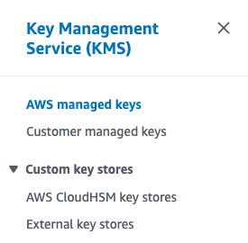

# AWS KMS keys with SSM secure strings

So today we learned a fun scenario with Secure Strings and how they are decrypted. So aws has what I guess are account managed keys, per service. So for ssm there is an aws managed key “aws/ssm” which is the normal default for encrypting ssm secure strings. And since this is an account managed key when a resource tries to access that secure key (As long as it has the correct get parameter access) it should have no problem getting it.

https://docs.aws.amazon.com/kms/latest/developerguide/concepts.html#aws-managed-cmk
https://docs.aws.amazon.com/kms/latest/developerguide/services-parameter-store.html

What was learned is for secure strings you can choose different kms keys to encrypt and decrypt. The catch is since you are no longer using the managed key the resource trying to access the secure sting also needs an IAM permission to allow decryption with that key.

```json title=''
{
  "Action": "kms:Decrypt",
  "Resource": "arn:aws:kms:us-east-1:XXX:key/XXX",
  "Effect": "Allow"
}
```


